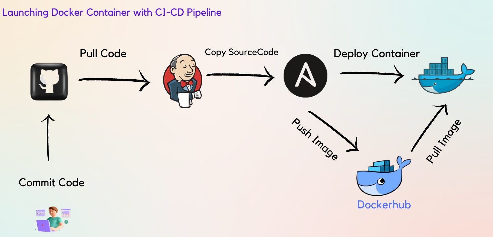
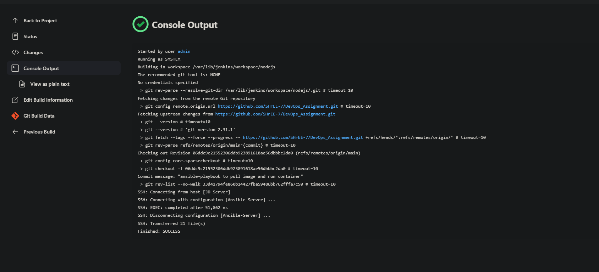
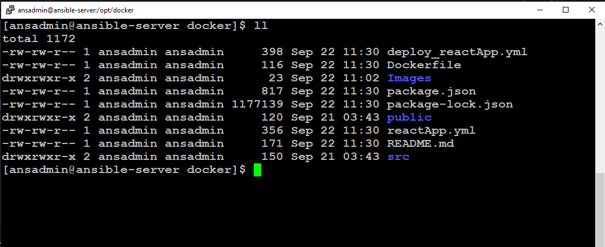
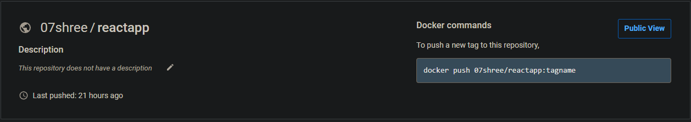
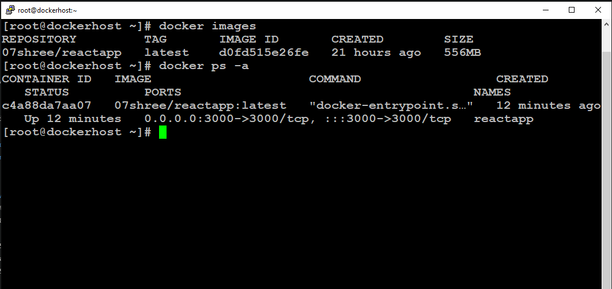
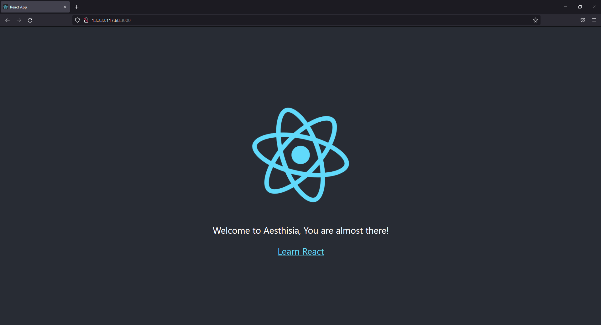

## **DevOps Project** 
### Launching Docker Container with Ci-CD Pipeline (React App)
<p align="center">  
	<br>
	  
	<br>
	<br>
</p>

### Steps followed to complete CI-CD Pipeline.
**Step 1** :- 
```
* Downloaded Jenkins and installed neccessary plugins. like github, copy over ssh (to copy source code or artifcats)

* Initialized job and configued it with github repo to pull code.
```
<p align="center">  
	<br>
	  
	<br>
	<br>
</p>

**Step 2** :-
```
* Launched ansible-server and configured it with jenkins to automate the build and deployment.

* Copied Source code from github to ansible-server & created docker image with help of Dockerfile.
```
<p align="center">  
	<br>
	  
	<br>
	<br>
</p>

**Step 3** :- 
```
* written reactApp.yml ansible-playbook to build docker image and push it on dockerhub.

* written deploy_reactApp.yml ansible-playbook to pull image from dockerhub and run container on dockerhost instance. 
```
<p align="center">  
	<br>
	  
	<br>
	<br>
</p>

<p align="center">  
	<br>
	  
	<br>
	<br>
</p>

## Deployed React app on Dockerhost instance
<p align="center">  
	<br>
	  
	<br>
	<br>
</p>